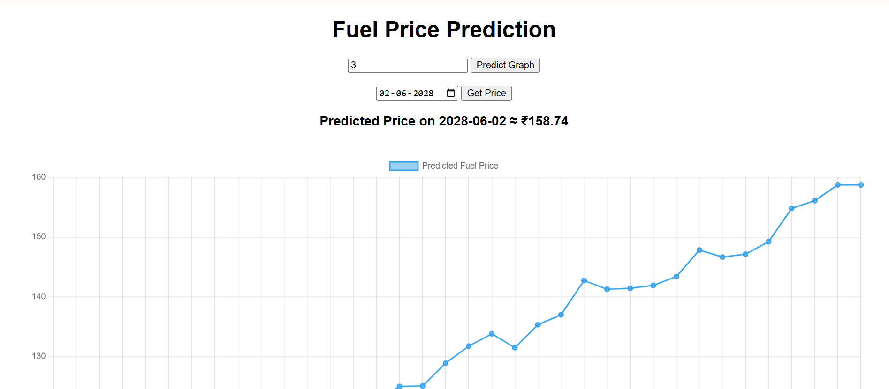

# ⛽ Fuel Price Prediction System

## 📌 Overview

This project is a **Machine Learning-based Fuel Price Prediction System** that forecasts future fuel prices using historical data. It uses **time series forecasting (Prophet)** and exposes predictions through a **FastAPI backend**, with a simple **HTML + JavaScript frontend** for visualization.

---

## 🚀 Features

* 📊 Predict fuel prices for future years
* 📈 Interactive graph using Chart.js
* 📅 Get predicted price for a specific date
* ⚡ FastAPI backend for real-time predictions
* 🔁 Supports dynamic input (years)
* 🧠 Model trained using Facebook Prophet

---

## 🛠️ Tech Stack

### Backend

* Python
* Pandas
* Prophet
* FastAPI
* Uvicorn

### Frontend

* HTML
* CSS
* JavaScript
* Chart.js

---

## 📂 Project Structure

```
Backend/
│
├── main.py              # Model training
├── api.py               # FastAPI backend
├── model.pkl            # Saved model
├── prophet_ready.csv    # Clean dataset
├── petrol_price.csv     # Raw dataset
│
frontend/
│
├── index.html           # Frontend UI
├── chart.js             # Chart library
```

---

## ⚙️ Installation & Setup

### 1. Clone Repository

```
git clone https://github.com/JashwanthDomala/Fule_prediction.git
cd Fule_prediction
```

---

### 2. Install Dependencies

```
pip install pandas prophet fastapi uvicorn scikit-learn
```

---

### 3. Run Backend Server

```
cd Backend
python -m uvicorn api:app --reload
```

---

### 4. Run Frontend

* Open `index.html` in browser

---

## 🌐 API Endpoints

### Home

```
GET /
```

### Predict Fuel Prices

```
GET /predict?years=5
```

---

## 📊 Model Details

* Model Used: **Facebook Prophet**
* Type: Time Series Forecasting
* Input: Historical fuel prices
* Output: Future predicted prices

---

## 📈 Evaluation Metrics

* MAE (Mean Absolute Error)
* RMSE (Root Mean Squared Error)

---

## 🧠 How It Works

1. Data is cleaned and converted into time series format
2. Prophet model is trained on historical data
3. Future dates are generated
4. Predictions are returned via API
5. Frontend visualizes results using charts

---

## 🎯 Future Improvements

* Support multiple fuel types (diesel, petrol, etc.)
* Deploy online (Render / AWS)
* Add better UI (React)
* Improve model accuracy

---

## 👨‍💻 Author

**Jashwanth Domala**

---

## 📌 Note

This project is built for academic purposes and demonstrates end-to-end ML system development.

